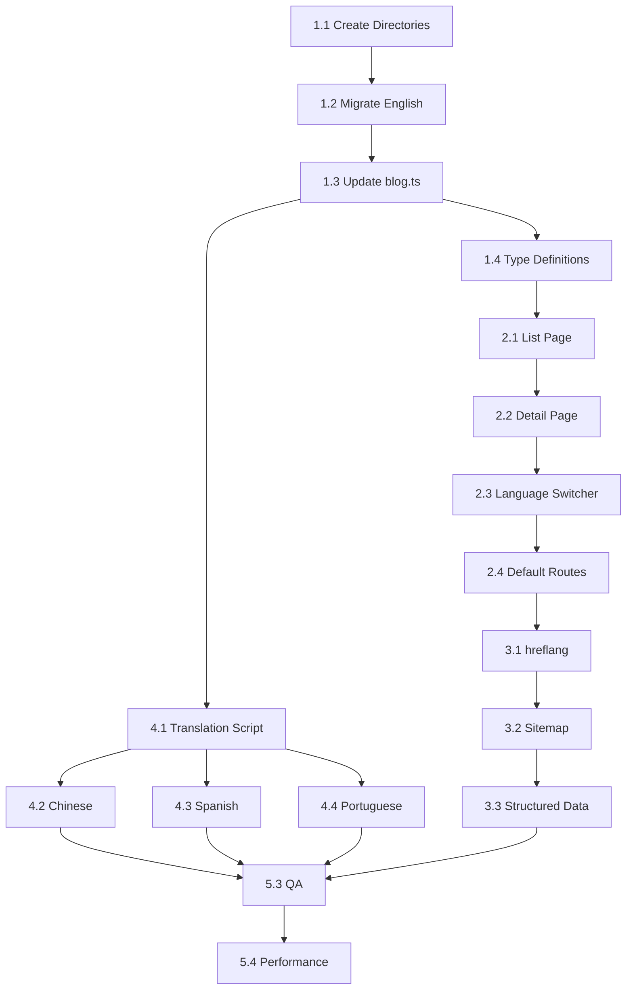

# Epic: Blog Multi-Language Support (博客多语言支持)

## Overview

**Epic ID**: BLOG-I18N-001  
**Status**: 🚀 In Progress (Phase 1 Complete)  
**Priority**: High  
**Estimated Effort**: ~54 hours  
**Target Languages**: English (en), Chinese (zh), Spanish (es), Portuguese (pt)  
**Total Articles**: 39 → 156 (39 × 4 languages)

## Current State Analysis

### Existing Infrastructure
- **Blog System**: 39 MDX articles in `content/blog/`
- **i18n Support**: Full infrastructure exists (`lib/i18n-config.ts`, `lib/translations.ts`)
- **Locale Routes**: `app/[locale]/` structure exists for other pages
- **Translation Files**: `locales/{en,zh,es,pt}.json` for UI strings

### Gap Analysis
| Component | Current | Target |
|-----------|---------|--------|
| Blog directory structure | Flat (`content/blog/`) | By locale (`content/blog/{locale}/`) |
| Blog data layer | Single language | Multi-language with fallback |
| Blog routes | `/blog/*` only | `/blog/*` + `/{locale}/blog/*` |
| SEO (hreflang) | Not implemented | Full cross-linking |
| Language switcher | Not on blog | Available translations shown |

---

## Architecture Decision

### Chosen Approach: Directory-Based Separation

```
content/blog/
├── en/                         # Default language (migrate existing)
│   ├── gamifying-destiny.mdx
│   ├── psychology-of-luck.mdx
│   └── ... (39 articles)
├── zh/                         # Chinese translations
│   ├── gamifying-destiny.mdx
│   └── ...
├── es/                         # Spanish translations
│   └── ...
└── pt/                         # Portuguese translations
    └── ...
```

### Rationale
1. ✅ Consistent with existing `app/[locale]/` structure
2. ✅ Clean separation for progressive translation
3. ✅ Easy AI translation tooling integration
4. ✅ Independent SEO for each language
5. ✅ Supports partial translation (graceful fallback)

---

## Phase Breakdown

### Phase 1: Foundation (基础架构) - 7h

| ID | Task | Description | Est. | Dependencies |
|----|------|-------------|------|--------------|
| 1.1 | Create directory structure | Create `content/blog/{en,zh,es,pt}/` directories | 0.5h | - |
| 1.2 | Migrate English articles | Move existing MDX files to `content/blog/en/` | 1.5h | 1.1 |
| 1.3 | Update `lib/blog.ts` | Add locale parameter to all functions | 3h | 1.2 |
| 1.4 | Add type definitions | Update `lib/blog-types.ts` for i18n | 1h | 1.3 |
| 1.5 | Unit tests for blog.ts | Verify multi-locale functionality | 1h | 1.4 |

**Deliverables**:
- [x] Directory structure created ✅
- [x] All 39 articles migrated to `en/` ✅
- [x] `getBlogPosts(locale)` working ✅
- [x] `getPostBySlug(slug, locale)` working ✅
- [x] `getAvailableTranslations(slug)` implemented ✅

**Completed**: 2025-01-27

### Phase 2: Routing Implementation (路由实现) - 8h

| ID | Task | Description | Est. | Dependencies |
|----|------|-------------|------|--------------|
| 2.1 | Blog list page | Implement `app/[locale]/blog/page.tsx` | 2h | 1.4 |
| 2.2 | Blog detail page | Implement `app/[locale]/blog/[slug]/page.tsx` | 3h | 2.1 |
| 2.3 | Language switcher | Component showing available translations | 2h | 2.2 |
| 2.4 | Default route handling | Redirect `/blog/*` or use `en` locale | 1h | 2.2 |

**Deliverables**:
- [ ] `/zh/blog/` shows Chinese articles
- [ ] `/es/blog/gamifying-destiny` works
- [ ] Language switcher shows available translations
- [ ] `/blog/*` routes continue working

### Phase 3: SEO Optimization (SEO优化) - 5h

| ID | Task | Description | Est. | Dependencies |
|----|------|-------------|------|--------------|
| 3.1 | hreflang metadata | Add alternate language links to blog pages | 2h | 2.4 |
| 3.2 | Update sitemap | Include all language versions in `app/sitemap.ts` | 2h | 3.1 |
| 3.3 | Structured data | Multi-language Article schema | 1h | 3.2 |

**Deliverables**:
- [ ] `<link rel="alternate" hreflang="zh" href="..."/>` on all blog pages
- [ ] Sitemap includes 156 blog URLs (39 × 4)
- [ ] JSON-LD Article schema per language

### Phase 4: Content Translation (内容翻译) - 27h

| ID | Task | Description | Est. | Dependencies |
|----|------|-------------|------|--------------|
| 4.1 | Translation script | Create `scripts/translate-blog.ts` using OpenRouter | 3h | 1.3 |
| 4.2 | Translate to Chinese | 39 articles → zh | 8h | 4.1 |
| 4.3 | Translate to Spanish | 39 articles → es | 8h | 4.1 |
| 4.4 | Translate to Portuguese | 39 articles → pt | 8h | 4.1 |

**Translation Script Features**:
```typescript
interface TranslationOptions {
  sourceLocale: 'en';
  targetLocale: 'zh' | 'es' | 'pt';
  preserveCodeBlocks: true;
  updateInternalLinks: true;  // Add locale prefix
  translateFrontmatter: ['title', 'description'];
  keepOriginal: ['author', 'date', 'tags', 'image'];
}
```

**Deliverables**:
- [ ] Working translation script
- [ ] 39 Chinese articles in `content/blog/zh/`
- [ ] 39 Spanish articles in `content/blog/es/`
- [ ] 39 Portuguese articles in `content/blog/pt/`

### Phase 5: Quality Assurance (测试与部署) - 7h

| ID | Task | Description | Est. | Dependencies |
|----|------|-------------|------|--------------|
| 5.1 | Unit tests | Test multi-locale blog functions | 2h | 2.4 |
| 5.2 | E2E tests | Playwright tests for blog i18n | 2h | 5.1 |
| 5.3 | Translation QA | Review translation quality | 2h | 4.2-4.4 |
| 5.4 | Performance check | Verify build time and Core Web Vitals | 1h | 5.3 |

**Quality Checklist**:
- [ ] All MDX files parse without errors
- [ ] Internal links resolve correctly
- [ ] Reading time calculated per language
- [ ] No hydration warnings
- [ ] Build completes under 5 minutes
- [ ] LCP < 2.5s on blog pages

---

## Implementation Workflow



---

## Technical Specifications

### 1. Updated `lib/blog.ts` API

```typescript
import { type Locale } from './i18n-config';

// Directory helper
function getPostsDirectory(locale: Locale = 'en'): string;

// Updated signatures
export function getAllPostSlugs(locale?: Locale): string[];
export function getBlogPosts(options?: {
  locale?: Locale;
  tag?: string;
  limit?: number;
  includeDrafts?: boolean;
}): BlogPostMeta[];
export function getPostBySlug(slug: string, locale?: Locale): BlogPost | null;
export function getPaginatedBlogPosts(options?: {
  locale?: Locale;
  tag?: string;
  page?: number;
  perPage?: number;
}): PaginatedBlogPosts;

// New functions
export function getAvailableTranslations(slug: string): Locale[];
export function getAllLocalizedSlugs(): { slug: string; locale: Locale }[];
```

### 2. Route Structure

```
app/
├── blog/                           # Default English (backwards compatible)
│   ├── page.tsx                   # Uses locale='en' internally
│   └── [slug]/
│       └── page.tsx
└── [locale]/
    └── blog/
        ├── page.tsx               # Multi-language blog list
        └── [slug]/
            └── page.tsx           # Multi-language blog detail
```

### 3. Translation Script Command

```bash
# Translate single article
npm run translate:blog -- --slug gamifying-destiny --locale zh

# Translate all articles to one language
npm run translate:blog -- --all --locale zh

# Translate all articles to all languages
npm run translate:blog -- --all --locale all

# Dry run (preview without writing)
npm run translate:blog -- --all --locale zh --dry-run
```

### 4. Frontmatter Translation Rules

```yaml
# Original (en)
---
title: "Gamifying Destiny: The Psychology of Daily Fortune Cookies"
description: "Why is opening a fortune cookie so addictive?"
date: "2025-12-15"
author: "Fortune Cookie Dev Team"
tags: ["psychology", "gamification", "ux-design"]
image: "https://images.unsplash.com/..."
---

# Translated (zh)
---
title: "游戏化命运：每日幸运饼干的心理学"
description: "为什么打开幸运饼干如此令人上瘾？"
date: "2025-12-15"                    # Keep original
author: "Fortune Cookie Dev Team"     # Keep original
tags: ["psychology", "gamification", "ux-design"]  # Keep original
image: "https://images.unsplash.com/..."           # Keep original
---
```

---

## Risk Assessment

| Risk | Probability | Impact | Mitigation |
|------|-------------|--------|------------|
| AI translation quality issues | Medium | Medium | Human review + quality checklist |
| Build time increase (156 files) | Low | Low | ISR/SSG optimization |
| SEO duplicate content | Low | High | Proper hreflang implementation |
| Internal link breakage | Medium | Medium | Link validation script |
| MDX parsing errors | Low | Medium | Validation in translation script |

---

## Success Metrics

1. **Coverage**: 100% articles translated to all 4 languages
2. **SEO**: All blog pages have valid hreflang tags
3. **Performance**: Build time < 5 minutes
4. **Quality**: No MDX parsing errors
5. **UX**: Language switcher shows correct available translations

---

## Commands Reference

```bash
# Development
npm run dev                           # Start dev server

# Translation
npm run translate:blog                # Run translation script

# Validation
npm run validate:blog                 # Validate all MDX files
npm run validate:links                # Check internal links

# Testing
npm run test:blog                     # Run blog unit tests
npm run test:e2e:blog                 # Run blog E2E tests

# Build
npm run build                         # Production build
npm run analyze                       # Bundle analysis
```

---

## Appendix: Article List (39 total)

1. gamifying-destiny.mdx
2. future-of-fortune-cookies-ar-vr-tech.mdx
3. year-of-the-horse-2026-ai-predictions.mdx
4. ai-fortune-telling-trends-2025.mdx
5. british-vs-american-fortune-cookie-culture.mdx
6. fortune-cookie-quotes-english-learning-motivation.mdx
7. fortune-cookies-japanese-origins.mdx
8. the-ethics-of-ai-prophecy.mdx
9. daily-affirmations-micro-habits-2025.mdx
10. psychology-of-luck.mdx
11. ai-fortune-writing-prompts.mdx
12. romantic-fortune-cookie-messages.mdx
13. learn-english-idioms-fortune-cookies.mdx
14. fortune-cookie-crafts-upcycling-ideas.mdx
15. wedding-fortune-cookie-messages-guide-2025.mdx
16. building-fortune-cookie-seo.mdx
17. lucky-girl-syndrome-digital-tools-2026.mdx
18. overcoming-decision-fatigue-ai-fortune-cookies.mdx
19. fortune-cookies-pop-culture.mdx
20. american-cultural-values-fortune-cookie-phrases.mdx
21-39. (remaining articles)

---

## Next Steps

1. **Immediate**: Create Phase 1 implementation branch
2. **Week 1**: Complete Foundation + Routing
3. **Week 2**: Complete SEO + Start Translation
4. **Week 3**: Complete Translation + QA
5. **Deploy**: Staged rollout (zh first, then es/pt)
